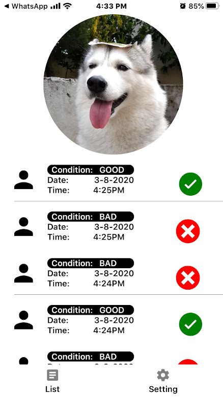
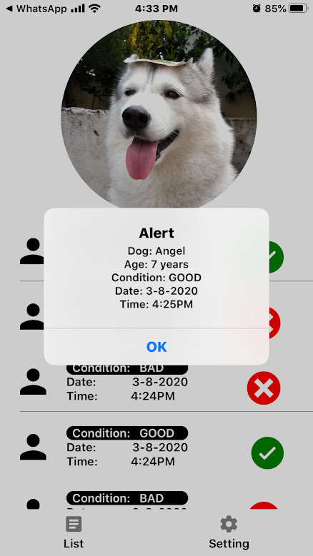

# DogPoopApp

## Present
- [ ] Reload Error: the setState from home screen to the useFirebase.js got some error 
  - [ ] Identify the error using console log first 
  
- [ ] use this for https://www.youtube.com/watch?v=LP6zmnMcHR0 header. Plan change. 
- [ ] CANCEL PLAN working on parralax navigation 
  - [x] Onscroll created
  - [x] Minimize photo created
  - [x] Connected to main screen
  - [ ] Need to study the how it work(youtube video, website, library from internets)
  - [ ] moving with animation to the header 
- [ ] Developing UI for user's decision 
  - [ ] User interface 
  - [ ] Arrange the overlay decision to new file 
- [ ] scroll and smaller pic and shift to top
  - [x] ScrollView Attached
  - [x] Smaller animation Attached
  - [ ] Go left side animation

## Future function
- [ ] Overlay do not have sorted flatlist 
- [ ] Add state on the icon 
- [ ] navigation codes 
- [ ] Arrange the flatlist to another file 
- [ ] Arrange the bottom navigation to another file 
- [ ] Developing modify record function to database 
- [ ] Developing delete record function to database 
- [ ] automation test 
- [ ] navigation from register screen 
- [ ] navigation to settings screen 
- [ ] swipe to delete implementation 
- [ ] grid view 
- [ ] firebase chat system 
- [ ] firebase Authentication 
- [ ] daily analysis 
- [ ] add user to a group 
- [ ] push notification if no one walk dog 
- [ ] monthly analysis 
- [ ] expo camera 
- [ ] dark mode 
- [ ] bark if u completed 1 walk 

## Done function
- [x] Sort the flatlist 
- [x] Solved key on flatlist
- [x] Developing save record function to database 
- [x] read record from database 
- [x] firebase realtime database 
- [x] Added icon 

## Screenshot

This is the first screen where we are able to check the dog's information.

This is the screen where we are able to check the information clearly

This is the overlay where we are able to save the dog activities

