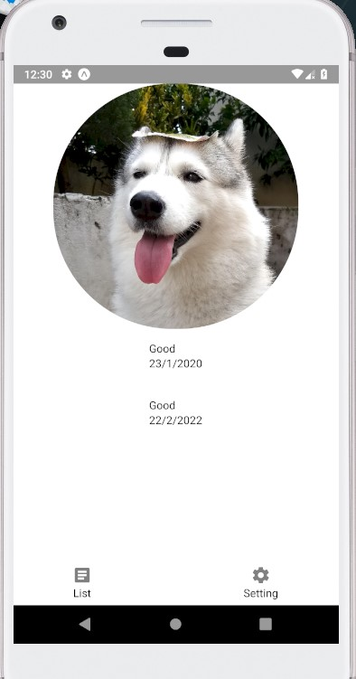
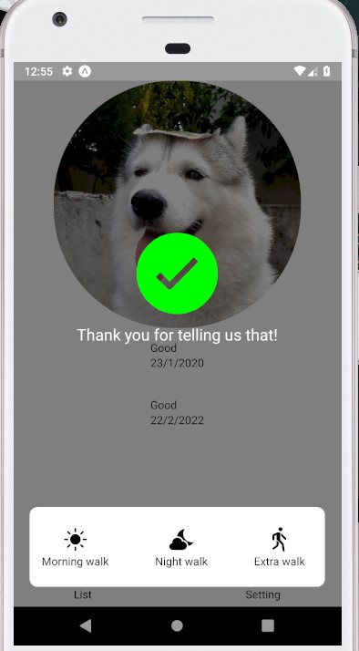

# DogPoopApp

## Present
- [ ] arrange the codes make it easy access 

## Future function
- [ ] Developing save record function to database 
- [ ] Developing modify record function to database 
- [ ] Developing delete record function to database 
- [ ] automation test 
- [ ] navigation to settings screen 
- [ ] swipe to delete implementation 
- [ ] grid view 
- [ ] scroll and smaller pic and shift to top
- [ ] firebase chat system 
- [ ] firebase Authentication 
- [ ] daily analysis 
- [ ] push notification 
- [ ] monthly analysis 
- [ ] expo camera 
- [ ] dark mode 
- [ ] bark if u completed 1 walk 

## Done function
- [x] read record from database 
- [x] firebase realtime database 

## Screenshot

This is the first screen where we are able to check the dog's information.

This is the settings screen where we are able to set something from the app.

