# DogPoopApp

## Screenshot
<table>
  <h3>The Login Screen</h3>
  <tr>
    
To get into the system we are able to login via a few methods which included Facebook authentication, email and password, and so on. This application have keyboard avoider as well. When we are typing on the textholder.

    <th>  
      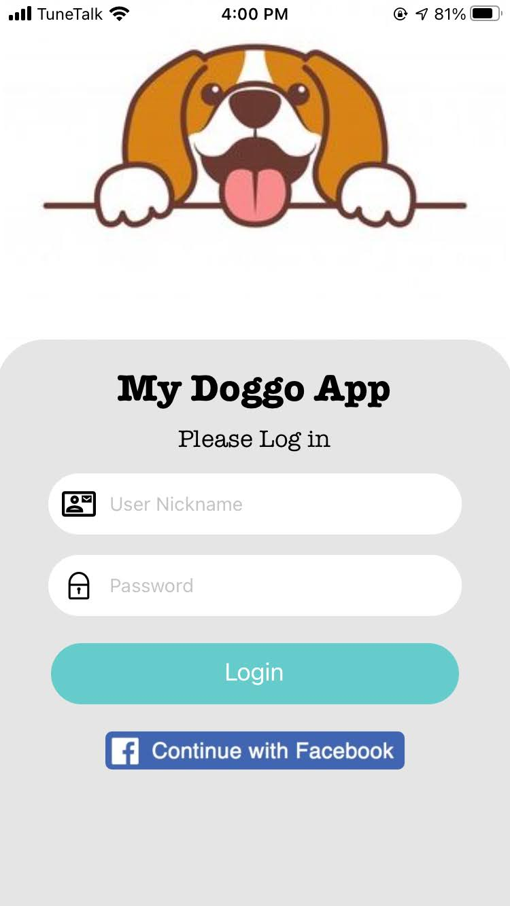
    </th>
    <th> 
      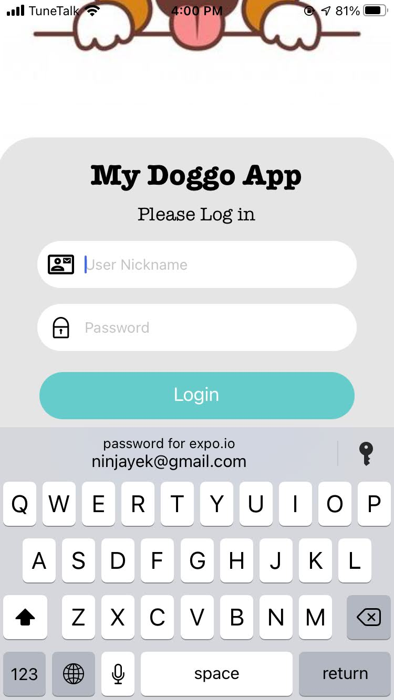
    </th>
    <th> 
      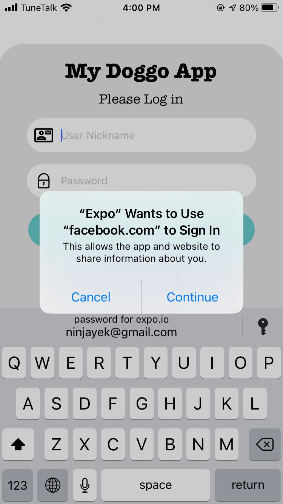
    </th>
    <th> 
      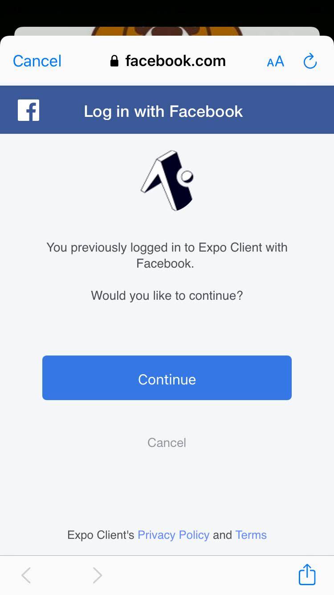
    </th> 
  </tr>
   
   
</table>  

<table>
  <h3>The Home Screen</h3>
  <tr>
    
After we get into the home screen we are able to register for first login user. Besides, we are able to check the condition when we press "Home" on the tab bar. If we press the list we are able to check the details. And lastly when we press the add icon we can add new record.

    <th>  
      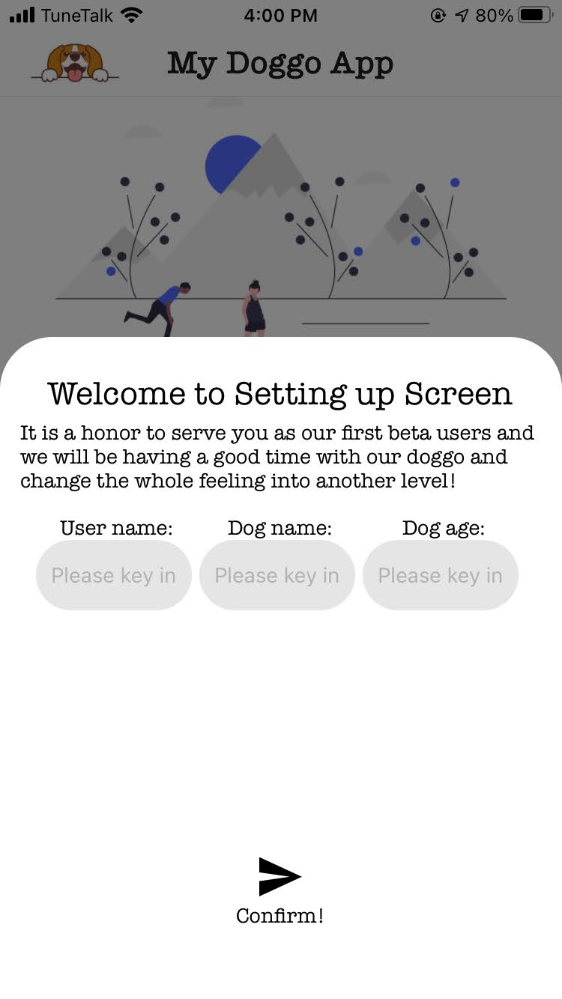
    </th>
    <th> 
      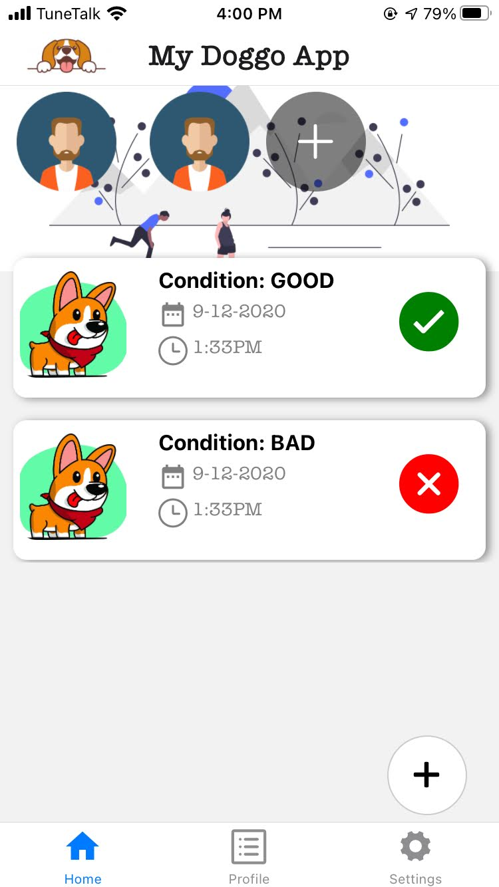
    </th>
    <th> 
      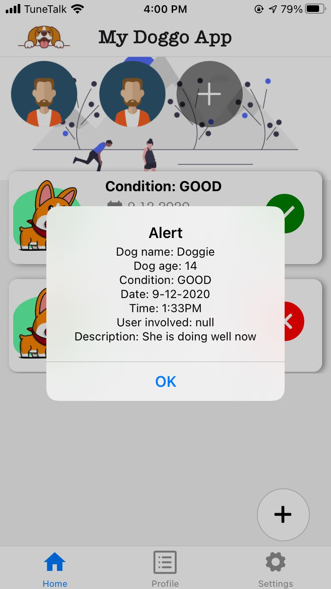
    </th>
    <th> 
      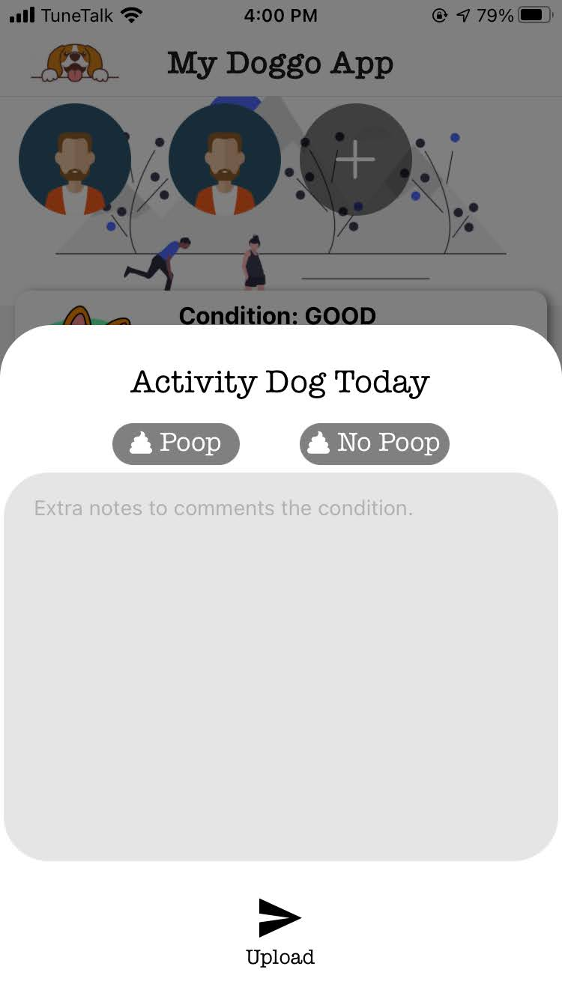
    </th> 
  </tr>
   
   
</table>  

<table>
  <h3>The Profile Screen and Setting Screen</h3>
  <tr>
    
The profile screen we are able to check the details of specific user. For setting screen we can perform action such as logout and so on. Many features still in development.

    <th>  
      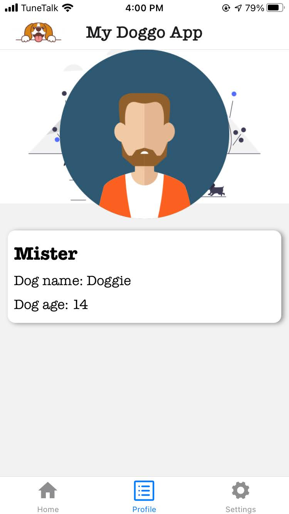
    </th>
    <th> 
      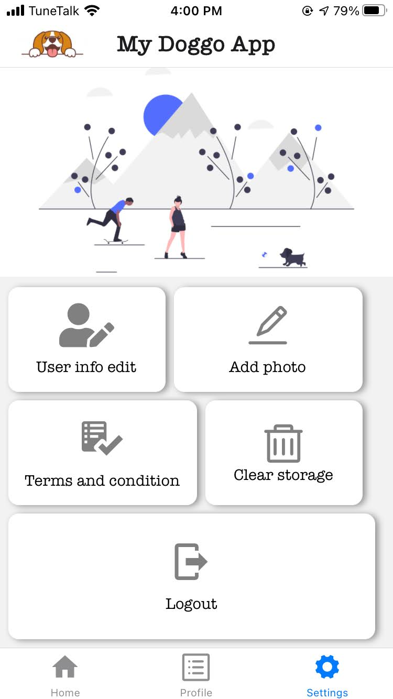
    </th>
    <th> 
      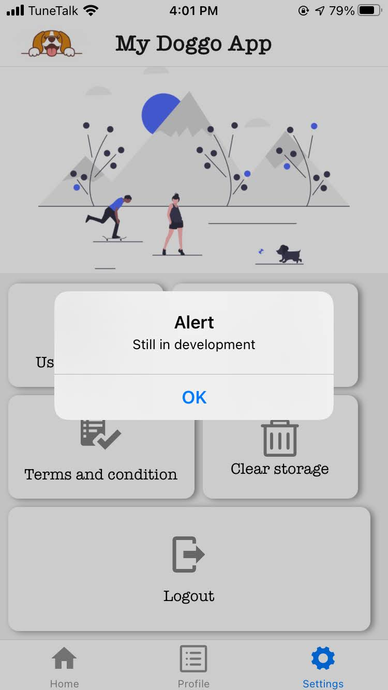
    </th>
    <th> 
      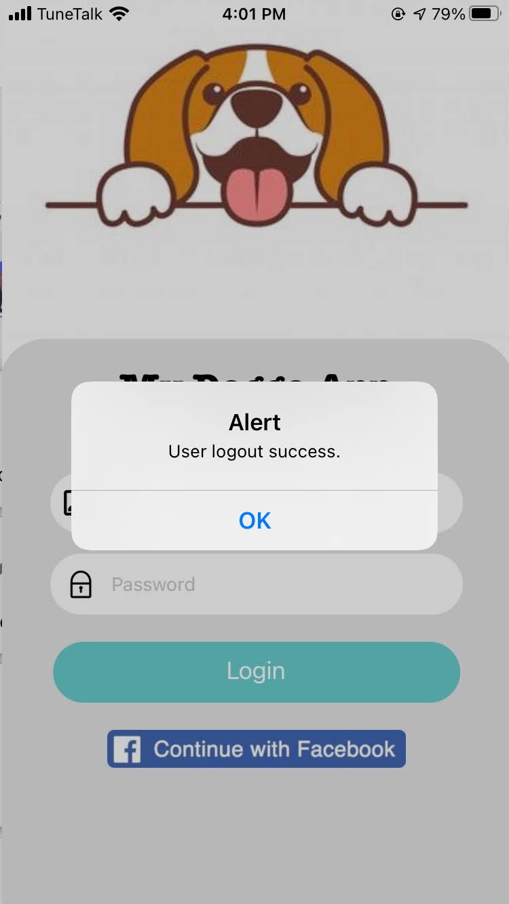
    </th> 
  </tr>
   
</table>  

## Present 
- [x] Screen for Profile
  - [x] Show dog name
  - [x] Show dog age
  - [x] Show user name
  - [ ] Walk quantity
  - [ ] Walk goal (graph)
- [ ] Screen for Settings
  - [ ] Register dog name
  - [ ] Register dog age
  - [ ] Register user photo
  - [ ] Register user name
- [ ] First register
  - [ ] Ask what group to join
  - [x] Others will prompt Screen for settings
- [ ] long press to do special action
- [ ] flatlist animation reload
- [ ] Float up on the image when want to login
- [ ] useState interaction with component
- [ ] User activities history screen
- [ ] Developing UI for group
  - [ ] Arrange the overlay decision to new file
- [ ] Join Groups
- [ ] Save the auth section to asyncStorage
- [ ] Add UI for the pop out modal at content screen
- [ ] REPLACE fingeprint push notification if no one walk dog
- [ ] Graph Analysis
- [ ] Add the sounds for upload then done

## Future function
- [ ] automation test
- [ ] swipe to delete implementation
- [ ] firebase chat system
- [ ] Google log in
- [ ] daily analysis
- [ ] monthly analysis
- [ ] Developing modify record function to database
- [ ] Developing delete record function to database
- [ ] firebase Authentication
- [ ] dark mode

## Done function
- [x] navigation to Login screen
- [x] navigation codes
- [x] Add loading screen
- [x] bark if u completed 1 walk
- [x] Reload Error: the setState from home screen to the useFirebase.js got some error
  - [x] Identify the error using console log first
- [x] Sort the flatlist
- [x] Solved key on flatlist
- [x] Developing save record function to database
- [x] read record from database
- [x] firebase realtime database
- [x] Added icon
- [x] Arrange the bottom navigation to another file
- [x] Fixed the UI arrangement on poop and no poop with a proper colour
- [x] settle the nesting navigation
- [x] Change the color of the flatlist into same color
- [x] Change the icon to better looking icon
- [x] navigation from register screen
- [x] navigation to settings screen
- [x] Add a floating button on right side for adding status
- [x] UI arrangement reorganized for neat
- [x] Add the img in
- [x] remove the library for google login
- [x] add scrollview
- [x] using normal login UI
- [x] Create Ui for the login screen
- [x] Facebook getting the userId
- [x] use flex to arrange the pop ui
- [x] reset the stack
- [x] Create a proper database logic, tree and hierachi
- [x] Fixed issue Loading indicator
- [x] Arrange the Modal to another file
- [x] Add the black transparent to the add icon on the group
- [x] Add the new design to login screen
